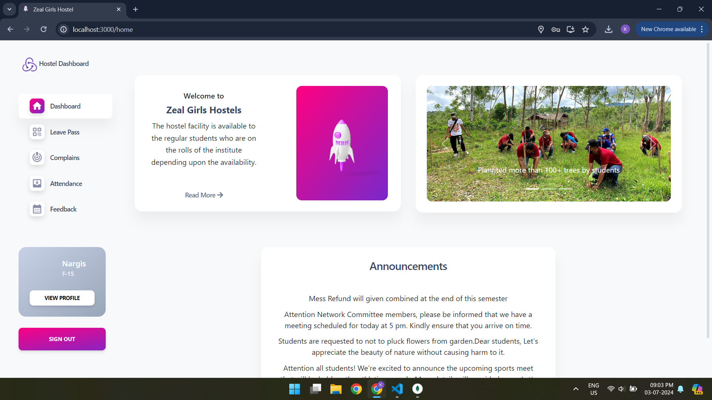
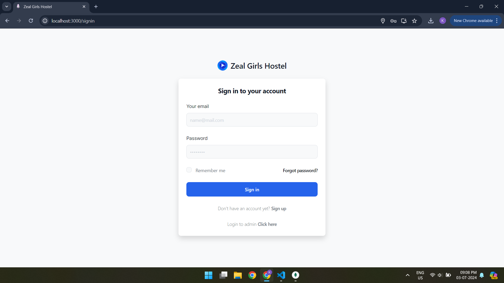
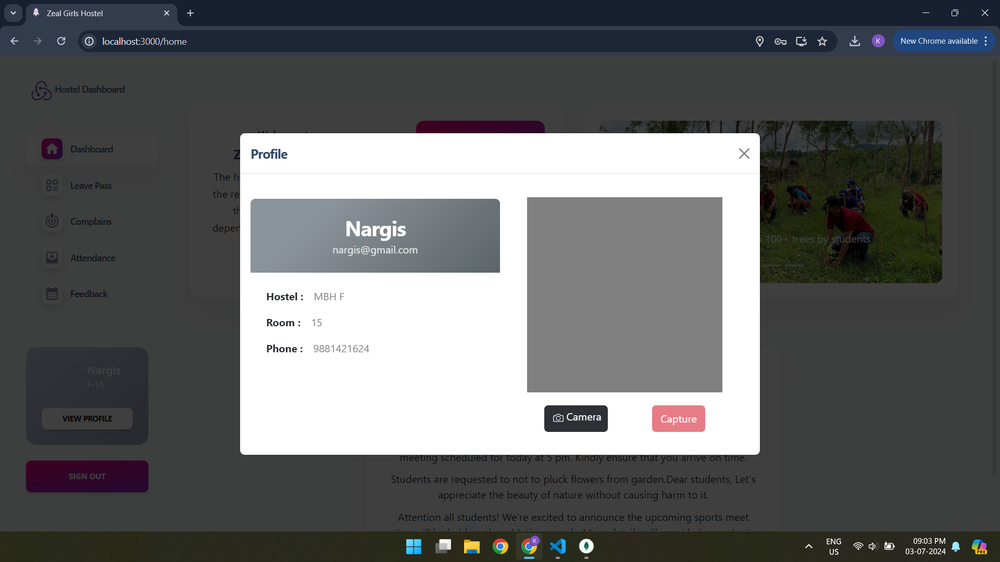
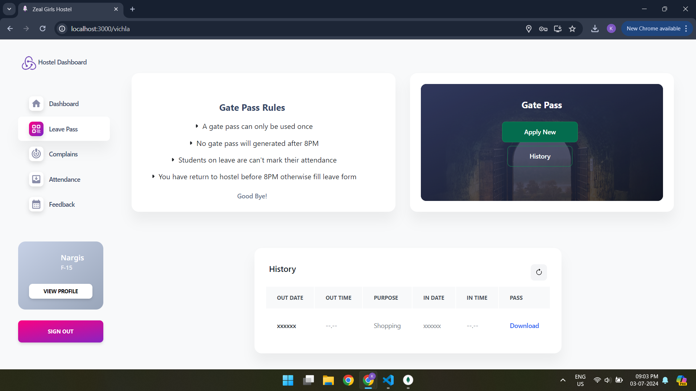

# Zeal Nexus:Student Abode

Zeal Nexus:Student Abode is a smart, scalable full-stack web platform designed to automate and streamline student housing operations. It features a modular architecture that supports real-time room booking, dynamic gate pass verification, complaint resolution tracking, and admin dashboards with actionable analytics.

Built with the MERN stack, the platform ensures role-based access control, mobile responsiveness, and secure authentication—delivering a seamless experience for students and administrators alike.

## 



#

## Key Features:

### Registration/Sign-in
- Students can register and create an account to access the system.
- Existing students can sign in using their credentials.



### Room Booking
- Students can view available rooms and book them based on their preferences and availability.




### QR-Based Gate Pass Token
- Students have to fill leave form and can download their gate pass .
- The gate pass token will be scanned by security personnel at the gate for verification.




### Attendance with Location Verification
- Students' attendance will be marked after location verification.
- The system checks if the student is not on leave before verifying the location.


### Complaint Section
- Students can submit complaints or issues they encounter within the hostel.
- They can track the status of their complaints and receive updates.


### Feedback Section
- Students can provide feedback on their experiences or suggest improvements.


### Admin Dashboard
- The admin dashboard provides access to manage and monitor various aspects of the hostel management system.
- Admins can view and manage registrations, room bookings, leave applications, attendance records, complaints, and feedback.


## Installation

```
2. Install the necessary dependencies:
```bash
cd Hostel_minor_project
npm install
```
3. Start the server
```bash
npm start
```
Access the application via http://localhost:3000.

Now Setup Backend

1. Install the necessary dependencies:
```bash
cd Backend
npm install
```
2. Start the server
```bash
node index.js
```
Access the application via http://localhost:5000.


# Configuration
You need to set your MongoDB URL in the `db.js` file located in the Backend folder.

```
const mongouri ="YOUR_MONGO_URL"
```
e.g. -> const mongouri ="mongodb://127.0.0.1:27017/app"
#

## Technologies Used
`NodeJS`,
`ExpressJS`,
`MongoDB`,
`ReactJS`,
`Tailwind`,
